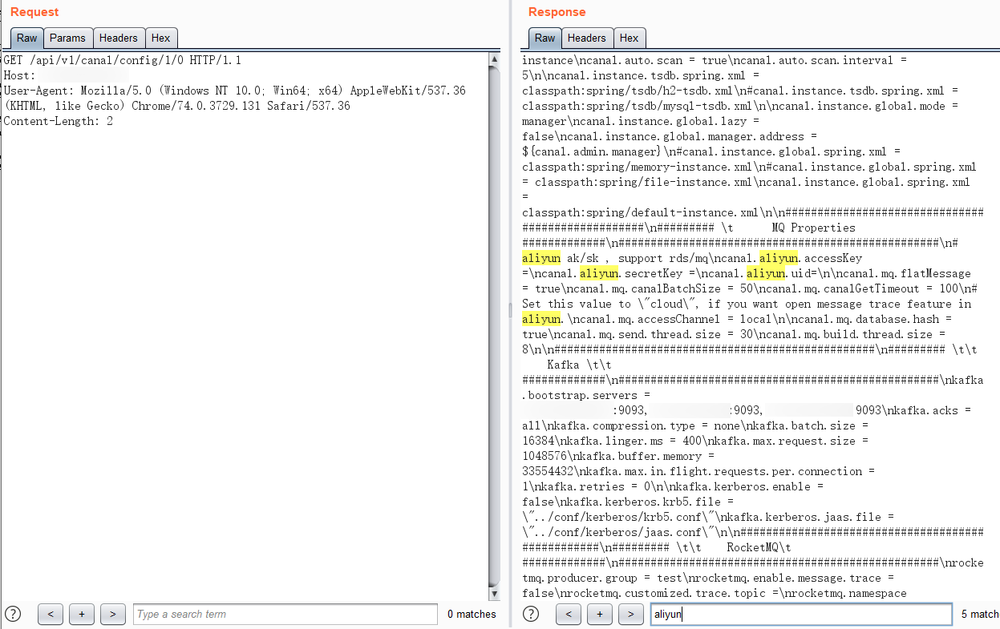

# Alibaba Canal config 云密钥信息泄露漏洞

## 漏洞描述

由于/api/v1/canal/config  未进行权限验证可直接访问，导致账户密码、accessKey、secretKey等一系列敏感信息泄露

## 漏洞影响

> [!NOTE]
>
> Alibaba Canal

## FOFA

> [!NOTE]
>
> title="Canal Admin"

## 漏洞复现

验证漏洞的Url为

```
/api/v1/canal/config/1/0
```



其中泄露了 aliyun.access 密钥，可以控制密钥下的所有服务器

