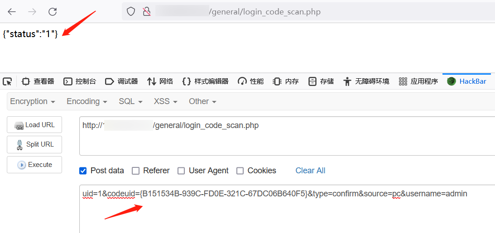
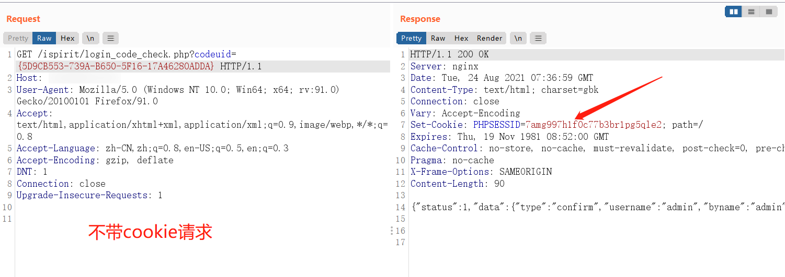
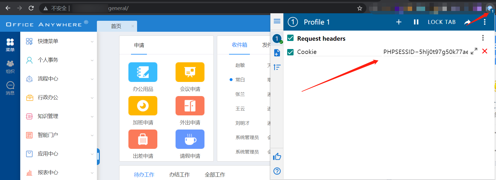

# 1、漏洞描述

通达OA部分版本存在任意用户登录漏洞，在未授权的情况下，通过一系列的请求操作，获取到合法的cookie，最终实现任意用户登录。

比任意在线用户登录漏洞更好一些，利用条件更低。

# 2、影响范围

通达OA < 11.5.200417版本
		通达OA 2017版本

# 3、本地环境搭建

下载其中一个受影响的版本安装包，直接傻瓜式下一步自动安装。

# 4、漏洞利用

首先，访问http://ip:port/ispirit/login_code.php ，获取到codeuid

其次，使用该codeuid作为post数据中的一部分，访问http://ip:port/general/login_code_scan.php ，返回status为1，则代表成功，否则返回status为0则代表失败，需要重复第一步获取新的codeuid，如果多次都是失败，则代表可能没有漏洞。

然后，同样使用该uid值作为传参，访问http://ip:port/ispirit/login_code_check.php?codeuid=【codeuid值】，与服务端交互，使得上一步客户端中使用的cookie合法。

如果是请求的时候没有带cookie，比如脚本请求，服务端会返回给客户端一个cookie。

最后，如果一直用的浏览器进行的操作，那么此时浏览器直接访问http://ip:port/general/index.php ，会发现已经成功登录上了admin账号，登录其他账号在第二步修改username的值。

或者在新的浏览器里，使用cookie编辑插件，通过第三步获取到的cookie值，访问http://ip:port/general/index.php ，直接登录。

# 5、exp

既是poc，也是exp，通过框架调用，支持批量，只打印存在漏洞的URL，同时返回cookie，方便验证，返回网站title，初步了解网站归属。