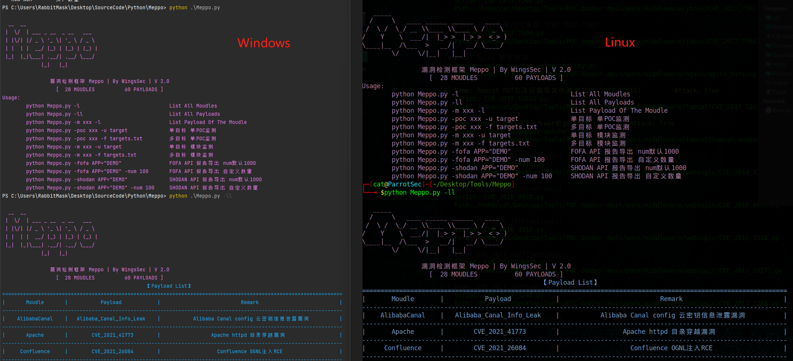

# Meppo
漏洞检测框架 Meppo | By WingsSec

### Update Log
##### V1.0 `2021-09-26` `框架开源`
##### V1.1 `2022-03-23` `正式开源`
            同时开源了大量高质量漏洞检测脚本
##### V2.0 `2022-04-07` 
            版本重大更新，我们换了套皮肤 /手动狗头
            优化框架交互，优化多种消息的颜色等级提示
            继fofa之后新增shodan、hunter API导出
            进一步丰富和优化脚本· `



```angular2html
  __  __
 |  \/  | ___ _ __  _ __   ___
 | |\/| |/ _ \ '_ \| '_ \ / _ \
 | |  | |  __/ |_) | |_) | (_) |
 |_|  |_|\___| .__/| .__/ \___/
             |_|   |_|

                漏洞检测框架 Meppo | By WingsSec | V 2.0
                  [  28 MOUDLES          60 PAYLOADS ]
Usage:
        python Meppo.py -l                              List All Moudles
        python Meppo.py -ll                             List All Payloads
        python Meppo.py -m xxx -l                       List Payload Of The Moudle
        python Meppo.py -poc xxx -u target              单目标 单POC监测
        python Meppo.py -poc xxx -f targets.txt         多目标 单POC监测
        python Meppo.py -m xxx -u target                单目标 模块监测
        python Meppo.py -m xxx -f targets.txt           多目标 模块监测
        python Meppo.py -fofa APP="DEMO"                FOFA API 报告导出 num默认1000
        python Meppo.py -fofa APP="DEMO" -num 100       FOFA API 报告导出 自定义数量
        python Meppo.py -shodan APP="DEMO"              SHODAN API 报告导出 num默认1000
        python Meppo.py -shodan APP="DEMO" -num 100     SHODAN API 报告导出 自定义数量


```
```angular2html
    __  ___
   /  |/  /__  ____  ____  ____
  / /|_/ / _ \/ __ \/ __ \/ __ \
 / /  / /  __/ /_/ / /_/ / /_/ /
/_/  /_/\___/ .___/ .___/\____/
           /_/   /_/

                漏洞检测框架 Meppo | By WingsSec | V 2.0
                  [  28 MOUDLES          60 PAYLOADS ]
usage: Meppo.py [-h] [-l] [-ll] [-m MOUDLE] [-u URL] [-f FILE] [-poc POC] [-fofa FOFA] [-shodan SHODAN] [-num NUM]

options:
  -h, --help      show this help message and exit
  -l              list
  -ll             list all
  -m MOUDLE       moudle
  -u URL          target url
  -f FILE         the file of target list

漏洞检测模块:
  -poc POC        漏洞检测

资产爬取模块:
  -fofa FOFA      资产爬取
  -shodan SHODAN  资产爬取
  -num NUM        资产数量
```
```angular2html
   _____                               
  /     \   ____ ______ ______   ____  
 /  \ /  \_/ __ \\____ \\____ \ /  _ \ 
/    Y    \  ___/|  |_> >  |_> >  <_> )
\____|__  /\___  >   __/|   __/ \____/ 
        \/     \/|__|   |__|

                漏洞检测框架 Meppo | By WingsSec | V 2.0
                  [  28 MOUDLES          60 PAYLOADS ]
                                                【Payload List】                                                
==================================================================================================================
|       Moudle       |           Payload            |                           Remark                           |
------------------------------------------------------------------------------------------------------------------
|    AlibabaCanal    |   Alibaba_Canal_Info_Leak    |           Alibaba Canal config 云密钥信息泄露漏洞          |
------------------------------------------------------------------------------------------------------------------
|       Apache       |        CVE_2021_41773        |                 Apache httpd 目录穿越漏洞                  |
------------------------------------------------------------------------------------------------------------------
|     Confluence     |        CVE_2021_26084        |                   Confluence OGNL注入RCE                   |
------------------------------------------------------------------------------------------------------------------
|        Demo        |             Demo             |                   robots.txt敏感信息泄露                   |
------------------------------------------------------------------------------------------------------------------
|        Demo        |             Test             |                          万能test                          |
------------------------------------------------------------------------------------------------------------------
|       Discuz       |discuz_version_change_getshell|              discuz 版本转换功能getshell漏洞               |
------------------------------------------------------------------------------------------------------------------
|       Drupal       |        CVE_2018_7600         |                        Drupal 7 RCE                        |
------------------------------------------------------------------------------------------------------------------
|       Drupal       |       CVE_2018_7600_8        |                        Drupal 8 RCE                        |
------------------------------------------------------------------------------------------------------------------
|       Drupal       |        CVE_2019_6340         |                      drupal8-REST-RCE                      |
------------------------------------------------------------------------------------------------------------------
|      ESAFENET      |       CNVD_2021_26058        |         亿赛通电子文档安全管理系统远程命令执行漏洞         |
------------------------------------------------------------------------------------------------------------------
|      EyouCMS       |     EyouCMS_qiantai_rce      |                       易优CMS前台RCE                       |
------------------------------------------------------------------------------------------------------------------
|         F5         |        CVE_2020_5902         |                F5 BIG-IP 远程代码执行漏洞1                 |
------------------------------------------------------------------------------------------------------------------
|         F5         |        CVE_2021_22986        |                F5 BIG-IP 远程代码执行漏洞2                 |
------------------------------------------------------------------------------------------------------------------
|       Fikker       |         Fikker_admin         |              fikker Console default password               |
------------------------------------------------------------------------------------------------------------------
|        H3C         |           IMC_RCE            |                        H3C IMC RCE                         |
------------------------------------------------------------------------------------------------------------------
|       Inspur       |        CVE_2020_21224        |               Inspur ClusterEngine V4.0 RCE                |
------------------------------------------------------------------------------------------------------------------
|       Inspur       |    Inspur_Any_user_login     |                    浪潮任意用户登录漏洞                    |
------------------------------------------------------------------------------------------------------------------
|       Inspur       |     Inspur_sysShell_RCE      |             浪潮ClusterEngineV4.0 sysShell RCE             |
------------------------------------------------------------------------------------------------------------------
|       Jeecms       |     Jeecms_ssrf_getshell     |                      Jeecms ssrf漏洞                       |
------------------------------------------------------------------------------------------------------------------
|       Kangle       |   Kangle_default_password    |                      kangle 默认密码                       |
------------------------------------------------------------------------------------------------------------------
|      Landray       |   Landray_OA_anyfile_read    |             蓝凌OA custom.jsp 任意文件读取漏洞             |
------------------------------------------------------------------------------------------------------------------
|      Landray       |Landray_OA_xmldecoder_getshell|               蓝凌OA xmldecoder 反序列化漏洞               |
------------------------------------------------------------------------------------------------------------------
|      Lanproxy      |        CVE_2021_3019         |                   Lanproxy 目录遍历漏洞                    |
------------------------------------------------------------------------------------------------------------------
|       Nexus        |        CVE_2019_7238         |                         Nexus RCE                          |
------------------------------------------------------------------------------------------------------------------
|       Seeyon       |       CNVD_2019_19299        |              致远OA A8 htmlofficeservlet RCE               |
------------------------------------------------------------------------------------------------------------------
|       Seeyon       |       CNVD_2020_62422        |             致远OA webmail.do任意文件下载检测              |
------------------------------------------------------------------------------------------------------------------
|       Seeyon       |       CNVD_2021_01627        |            致远OA ajax.do登录绕过 任意文件上传             |
------------------------------------------------------------------------------------------------------------------
|       Seeyon       |      Information_seeyou      |                    致远OA 敏感信息泄露                     |
------------------------------------------------------------------------------------------------------------------
|       Seeyon       | Seeyon_OA_SessionLeak_Upload |            致远OA Session泄露 任意文件上传漏洞             |
------------------------------------------------------------------------------------------------------------------
|       Seeyon       |    Seeyon_OA_Session_Leak    |         致远OA getSessionList.jsp Session泄漏漏洞          |
------------------------------------------------------------------------------------------------------------------
|       Seeyon       |    Seeyon_OA_SQLInjection    |                     致远OA SQL注入漏洞                     |
------------------------------------------------------------------------------------------------------------------
|     SonarQube      |        CVE_2020_27986        |                SonarQube API 未授权访问漏洞                |
------------------------------------------------------------------------------------------------------------------
|       Spring       |        CVE_2022_22947        |                  Spring Cloud Gateway RCE                  |
------------------------------------------------------------------------------------------------------------------
|       Spring       |        CVE_2022_22963        |                    spring_function_rce                     |
------------------------------------------------------------------------------------------------------------------
|       Spring       |        CVE_2022_22965        |                      Spring Core RCE                       |
------------------------------------------------------------------------------------------------------------------
|        TDXK        |     TDXK_Any_file_upload     |                   TDXK_前台任意文件上传                    |
------------------------------------------------------------------------------------------------------------------
|        TDXK        |     TDXK_Any_user_login      |                     TDXK_任意用户登录                      |
------------------------------------------------------------------------------------------------------------------
|        TDXK        | TDXK_logined_any_file_upload |                   TDXK_登录后任意文件上传                  |
------------------------------------------------------------------------------------------------------------------
------------------------------------------------------------------------------------------------------------------
|       Weaver       |       CNVD_2019_32204        |                泛微OA Bsh 远程代码执行漏洞                 |
------------------------------------------------------------------------------------------------------------------
|       Weaver       |  Weaver_e_Bridge_file_read   |               泛微云桥 e-Bridge 任意文件读取               |
------------------------------------------------------------------------------------------------------------------
|       Weaver       |     Weaver_e_Cology_RCE      |            泛微E-Cology WorkflowServiceXml RCE             |
------------------------------------------------------------------------------------------------------------------
|       Weaver       |Weaver_e_cology_v9_file_upload|         泛微OA weaver.common.Ctrl 任意文件上传漏洞         |
------------------------------------------------------------------------------------------------------------------
|       Weaver       |  Weaver_OA_V8_sqlinjection   |                   泛微OA V8 SQL注入漏洞                    |
------------------------------------------------------------------------------------------------------------------
|      Weblogic      |        CVE_2014_4210         |                     Weblogic SSRF漏洞                      |
------------------------------------------------------------------------------------------------------------------
|      Weblogic      |        CVE_2017_10271        |              Weblogic XML Decoder反序列化漏洞              |
------------------------------------------------------------------------------------------------------------------
|      Weblogic      |        CVE_2018_2894         |                  Weblogic任意文件上传漏洞                  |
------------------------------------------------------------------------------------------------------------------
|      Weblogic      |        CVE_2019_2725         |                        Weblogic RCE                        |
------------------------------------------------------------------------------------------------------------------
|      Weblogic      |        CVE_2020_16882        |               Weblogic未授权远程代码执行漏洞               |
------------------------------------------------------------------------------------------------------------------
|      Weblogic      |        CVE_2021_2109         |               Weblogic LDAP 远程代码执行漏洞               |
------------------------------------------------------------------------------------------------------------------
|      Weblogic      |  Weblogic_Console_Info_Leak  |                   Weblogic控制台路径泄露                   |
------------------------------------------------------------------------------------------------------------------
|       Zabbix       |        CVE_2016_10134        |                       Zabbix SQL注入                       |
------------------------------------------------------------------------------------------------------------------
|       Zabbix       |   Zabbix_default_password    |                      zabbix 默认密码                       |
==================================================================================================================

```